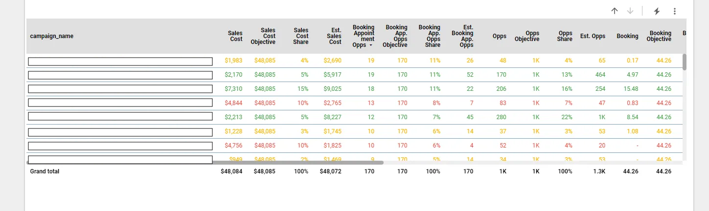

# Budget Checker

## **Overview**
This project provides a SQL-based solution for analyzing and monitoring the performance of marketing campaigns. The `budget-checker.sql` script aggregates and evaluates campaign performance over 7-day (L7D) and 30-day (L30D) periods. The results enable insights into the cost distribution and effectiveness of campaigns, particularly for **Sales Objectives**.

---

# Part 1 - BigQuery

## **1. Data Modelling**

### **1.1 Scope and Context**
- The dataset includes campaigns with two primary objectives: **Sales** and **Purchase**.
- This example focuses solely on **Sales Objective** campaigns.
- Metrics other than costs are exclusively tailored for sales-oriented analysis, thus do not filter with `objective='sales'`.

### **1.2 Data Structure**
- **Final Table**: A daily campaign performance dataset that serves as the foundation of this query. For more details, check the related repository: [**fully-automated-performance-marketing-dashboard**](https://github.com/oguzgn/fully-automated-performance-marketing-dashboard).

### **1.3 Modelling Approach**
- **Time Intervals**: Metrics are aggregated over:
  - **Last 7 Days (L7D)**
  - **Last 30 Days (L30D)**
- **Partition By Logic**:
  - **Partition by Objective**: Provides an overview of all sales campaigns combined.
  - **Partition by Campaign**: Focuses on the performance of individual campaigns.
  - This enables both general and campaign-specific performance insights.

### **1.4 Fixed Time Range**
- **7-Day Metrics**: If a date falls within the last 7 days, the same aggregated value is assigned to all rows in this range.
- **30-Day Metrics**: Metrics span the full 30-day period, with no further breakdown.

---

## **2. Code Structure**

### **2.1 temp1**
This step processes raw data using `CASE WHEN` logic to aggregate metrics by time intervals. Key calculations:
- **Objective-Level Metrics**: Aggregates performance for all sales campaigns combined.
- **Campaign-Level Metrics**: Aggregates performance for each individual campaign.

### **2.2 temp2**
- Removes redundant values from `temp1`.
- Adds additional dimensions (e.g., channel, country) for granular filtering and segmentation.

### **2.3 Final Query**
- Outputs the processed data, sorted by **30-day campaign cost (Sales_Cost_campaign_L30D)**.

---

## **3. Use Case Example**
Suppose there are 15 **Sales Campaigns**:
- **Partition by Objective**: Displays the total performance of all 15 campaigns.
- **Partition by Campaign**: Highlights the individual contribution of each campaign.

This structure enables the identification of campaigns with the highest cost and performance, facilitating informed decision-making.

---

## **4. Notes**
- Data is limited to the most recent 30 days.
- The daily structure of the dataset enhances the ability to analyze and monitor performance marketing dashboards effectively.

---

# Part 2 - Looker 

## Looker Setup for Dynamic Budget Allocation

### Budget Data Aggregation

- The **budget-checker query** we created allowed us to group the key metrics of the campaigns for the last 7 and 30 days.
- Using the **campaign objective**, we gathered the total values of all sales campaigns for both 7 and 30 days. Now, we can calculate the share of each campaign's metrics within the overall metrics of all campaigns.
    - For example, we can make statements like: "In the last 7 days, the booking share from campaign X is 30%, while the cost share is 7%."

### Adjusting Weights for KPI Optimization

- We need to adjust the weight of the KPIs we care about to increase their impact on budget allocation. For instance, if **Sales CAC** is crucial for us, we can increase its weight in the calculation.
- This requires a dynamic model because company priorities and strategies can change over time.

### Parameters in Looker Studio

We can implement this dynamic model in **Looker Studio** using Parameters. The parameters we need are:

- Periodic Budget
- Opportunity or Made?
- Opportunity Breakdown
- Made Breakdown

By adjusting the weight between Opportunity and Made, we can make the corresponding breakdowns more effective and execute sharper budget allocations.


## 1. Creation of Necessary Parameters:

- Based on the above requirements, I created the draft model.

### 30-day or 7-day selection:
- I added the option to choose between 30-day or 7-day periods. This parameter will allow the optimization of budget allocation based on either shorter or longer time frames.


### Sales Budget Plan:


### Opps vs Made (Sales KPI Distribution):

- A crucial part of the budget distribution model is how we handle the balance between Opportunities (Opps) and Made (sales closed).
- The weight given to Opps vs. Made will directly affect how the budget is allocated to campaigns focusing on opportunities versus those that focus on actual sales.
- For example, if the company is more focused on increasing the number of opportunities in a given period, the model should increase the weight for Opps.
- On the other hand, if the strategy shifts toward closing more sales (Made), then the weight for Made will increase, and the budget allocation will reflect that shift.
- This dynamic model will be achieved by using parameters in Looker Studio, allowing us to adjust the Opps vs. Made balance depending on the company’s current objectives.


### Opps Breakdown (Sales Opps Weight):

- The "Opps Breakdown" compares the weight of important opportunities, such as booking and appointment opportunities, against the total opportunities.
- This allows for prioritizing campaigns that focus on the most critical sales opportunities.
  


### Made Breakdown (Sales Lead Weight):

- The "Made Breakdown" compares the weight of Sales CAC with the cost per lead (CPL).
- This helps prioritize campaigns that are more effective at converting leads into closed sales while optimizing cost efficiency.


## 2. Create the Necessary Calculated Fields

- First, we need to perform the following three calculations for each metric:
    - These calculations involve matching the 7 or 30-day parameters with metrics and calculating the share of each metric per campaign.


###  Create the Formula for the Next Step

- Now that we've calculated the share for all metrics, we can proceed to the next step, where we create the formula outlined in the draft above. This will give meaning and functionality to our parameters.


```
(1 - Sales KPI Distribution) * ((1 - Sales Opps Weight) * Booking App. Opps Share + Sales Opps Weight * Opps Share)
+ Sales KPI Distribution * ((1 - Buyers Leads Weight) * Buyers Share + Buyers Leads Weight * Leads Share)
```

### Creating "Recom. Sales Budget Share"

At this stage, we have created the "Recom. Sales Budget Share" field, and our foundation is set.

This formula provides a percentage value based on the campaign's share and the weights we defined. It essentially tells us: "Based on the importance ranking we have set, this is the percentage value for your campaign, but how much Cost share did you allocate? If you allocated less than we recommended, we will increase it proportionally. If you allocated more, we will decrease it by the difference, to bring everything into balance."


- In the next phase, we proceed to calculate the **estimated** share for each metric.
- To do this, we need to calculate the **CP (Cost Per)**, or unit cost, for each metric.


- **Estimated Sales Cost** is a bit different. For this, we take the total sales cost because the **Recom. Sales Budget Share** is calculated separately for each campaign. Therefore, multiplying the total cost by the recommended share gives us the expected spending amount.
- **Estimated Sales Cost** will serve as a base for many aspects, such as:


For example, here we calculate the recommended lead by dividing the recommended cost by the unit lead cost. Let's say we have a 1000 cost, an estimated cost of 1100, and a CP leads of 100. Normally, we would get 10 leads from this. But if we divide by the **estimated sales cost**, we get 11 leads. So, it suggests that there could have been 11 leads. This is the logic.
- The same process is applied for each metric.
- The final step is to calculate the score for each metric.

  

# And at the end of this long process, we obtain a model like the one below:

  
  
  
  

# THANKS!
---

